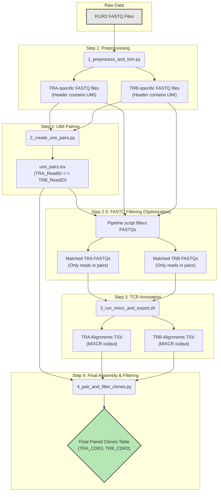

# PairTCR Pipeline Documentation

## Chapter 1: Introduction

### 1.1 Purpose of the Pipeline

Welcome to the PairTCR analysis pipeline. The primary goal of this software is to identify and quantify paired T-cell receptor (TCR) alpha (TRA) and beta (TRB) chains from paired-end high-throughput sequencing data. In immunology, the TCR is a protein complex on the surface of T lymphocytes (or T cells) responsible for recognizing fragments of antigen as peptides bound to major histocompatibility complex (MHC) molecules.

The specificity of this recognition is determined by the unique combination of a TRA chain and a TRB chain. Understanding the exact TRA/TRB pair that forms a single T-cell's receptor is crucial for understanding its antigen specificity, tracking clonal responses to vaccines or diseases, and developing novel immunotherapies.

This pipeline is engineered to reconstruct these vital TRA-TRB pairs from raw sequencing reads, transforming vast amounts of genomic data into actionable biological insights.

### 1.2 Design Philosophy

The pipeline is built on a foundation of several key principles to ensure it is robust, user-friendly, and efficient:

1.  **Modularity and Separation of Concerns**: The entire workflow is decomposed into distinct, sequential steps, with each major task handled by a dedicated script (e.g., `1_preprocess_and_trim.py`, `2_create_umi_pairs.py`, etc.). This modular design makes the pipeline easier to understand, debug, and modify. It isolates complex processes, such as UMI-based read linkage and biological sequence annotation, allowing for focused development and validation.

2.  **Automation and Orchestration**: The `5_runpipeline.py` script serves as the master controller or orchestrator. It automates the execution of all steps in the correct sequence, manages the flow of data through intermediate files, handles logging, and provides a single, simple interface for the user. This is crucial for ensuring reproducibility and ease of use.

3.  **State Management and Resumability**: The pipeline is designed to be fault-tolerant. Before executing a step, the orchestrator script checks for the existence of that step's expected output files. If the files exist and are not empty, the step is skipped. This intelligent state-checking allows the pipeline to be restarted from the point of failure, saving significant computational time if an error occurs partway through a long run. A `--force` flag is provided to override this behavior and start the entire process from scratch.

4.  **Performance Optimization**: A critical, non-obvious optimization is built into the workflow. After identifying potential TRA-TRB pairs based on UMI linkage (Step 2), the pipeline creates a new, filtered set of FASTQ files containing *only* the reads that are part of a valid pair (Step 2.5). This significantly reduces the number of reads that the computationally intensive MiXCR tool needs to process in the subsequent annotation step, leading to major performance gains and reduced runtime.

5.  **Clarity and Debugging**: The pipeline is designed for transparency. All intermediate files are stored in dedicated, clearly named directories corresponding to each step. Furthermore, comprehensive logs are generated for the overall pipeline and for each individual step. This structured output makes it straightforward to trace the data flow, inspect intermediate results, and diagnose issues at any stage of the analysis.

## Chapter 2: Pipeline Workflow and Data Flow

The pipeline executes a series of scripts to process the data from raw reads to final paired clones. The following diagram illustrates the overall workflow.



### 2.1 Step-by-Step Breakdown

#### **Step 1: Preprocess and Trim (`1_preprocess_and_trim.py`)**

*   **Purpose**: To identify reads originating from TRA or TRB transcripts, extract their UMIs, and clean the sequences.
*   **Input**: Raw paired-end FASTQ files (`*_1.fq.gz`, `*_2.fq.gz`).
*   **Process**:
    1.  The script scans each read pair for specific DNA adapter and linker sequences that are unique to the TRA and TRB library preparation constructs.
    2.  If a construct is found, it extracts the two Unique Molecular Identifiers (UMIs) embedded within it.
    3.  The UMI information is concatenated and appended to the FASTQ header of both reads in the pair (e.g., `@READ_ID UMI:TRA:GATTACA_CATTGTC`).
    4.  The read sequence is trimmed to remove all non-biological bases (adapters, linkers, UMIs), leaving only the endogenous TCR transcript sequence for downstream analysis.
*   **Output**: Four new gzipped FASTQ files, segregated by chain type: `PREFIX_TRA_1.fq.gz`, `PREFIX_TRA_2.fq.gz`, `PREFIX_TRB_1.fq.gz`, and `PREFIX_TRB_2.fq.gz`.

#### **Step 2: Create UMI Pairs (`2_create_umi_pairs.py`)**

*   **Purpose**: To link TRA and TRB reads that originated from the same single cell.
*   **Process**: This step leverages a key feature of the library design: the UMI sequence for a TRB read is the reverse complement of the UMI from its corresponding TRA read.
    1.  It first reads all `_TRA_1.fq.gz` records and builds a dictionary mapping each unique TRA UMI to the set of read identifiers that carry it.
    2.  It then calculates the reverse complement of every TRA UMI and creates a second map: `reverse_complement(TRA_UMI) -> original_TRA_UMI`.
    3.  Finally, it iterates through the `_TRB_1.fq.gz` file. For each TRB read, it extracts the UMI and checks if this UMI exists as a key in the reverse-complement map.
    4.  If a match is found, it means a pair has been identified. The script records the association between the base Read ID of the TRB read and the corresponding TRA read(s).
*   **Output**: A tab-separated file (`umi_pairs.tsv`) with two columns: `TRA_Read_ID_Base` and `TRB_Read_ID_Base`, explicitly listing every read pair derived from a single original RNA molecule.

#### **Step 2.5: Create Matched FASTQ (Internal to `5_runpipeline.py`)**

*   **Purpose**: To optimize the pipeline by reducing the input size for the most computationally expensive step (MiXCR).
*   **Process**:
    1.  The pipeline orchestrator reads the `umi_pairs.tsv` file and compiles a unique set of all TRA and TRB read IDs that were successfully paired.
    2.  It then filters the four FASTQ files from Step 1, writing new FASTQ files that contain *only* the reads whose IDs are in this "paired" set.
*   **Output**: A new set of smaller, "matched" FASTQ files located in the `matched_fastq_output/` directory.

#### **Step 3: Run MiXCR and Export (`3_run_mixcr_and_export.sh`)**

*   **Purpose**: To perform TCR sequence annotation using the MiXCR tool.
*   **Input**: The filtered, "matched" FASTQ files from Step 2.5.
*   **Process**: This shell script automates the MiXCR workflow.
    1.  It runs `mixcr analyze amplicon` separately on the TRA and TRB FASTQ pairs. This step aligns the reads to a reference library of V, D, and J genes. Crucially, it uses the `--align "-OsaveOriginalReads=true"` option to ensure the original FASTQ header (with our UMI tag) is preserved.
    2.  It then runs `mixcr assemble` to build clones from the alignments.
    3.  Finally, it uses `mixcr exportAlignments` to generate detailed, human-readable reports. The export format is configured to include the V/J gene calls, the nucleotide and amino acid sequences of the CDR3 region, and the original read description (`-descrsR1`), which contains the all-important read ID needed for the final pairing.
*   **Output**: Two TSV files: `TRA_alignments_export_with_headers.tsv` and `TRB_alignments_export_with_headers.tsv`.

#### **Step 4: Pair and Filter Clones (`4_pair_and_filter_clones.py`)**

*   **Purpose**: To integrate all processed data into a final, comprehensive table of paired TRA-TRB clones.
*   **Input**: The `umi_pairs.tsv` file from Step 2 and the two MiXCR alignment reports from Step 3.
*   **Process**: This Python script uses the `pandas` library to perform a series of database-style joins.
    1.  It first loads the two MiXCR alignment tables and filters them to remove cross-chain mis-alignments (e.g., a read from a TRB library file that MiXCR incorrectly annotated as a TRA gene).
    2.  It extracts the base read ID from the header column in each table.
    3.  It merges the `umi_pairs.tsv` table with the filtered TRA alignment table, joining on the `TRA_Read_ID_Base`.
    4.  It then merges that combined result with the filtered TRB alignment table, joining on the `TRB_Read_ID_Base`.
*   **Output**: The final result of the entire pipeline: `final_paired_clones_filtered.tsv`. Each row in this file represents one successfully sequenced, assembled, and annotated TRA-TRB pair, complete with V/J gene usage and CDR3 sequences for both chains.

## Chapter 3: Installation and Usage

### 3.1 Dependencies

- Python 3.x
- `pandas` library
- `tqdm` library
- MiXCR (v3.x or later)

### 3.2 Running the Pipeline

The entire pipeline is executed via the `5_runpipeline.py` script.

**Basic Usage:**

```bash
python3 scripts/5_runpipeline.py /path/to/raw/fastq/dir
```

**Common Arguments:**

*   `input_dir`: (Positional) The path to the directory containing your raw `_1.fq.gz` and `_2.fq.gz` files. Defaults to `./raw`.
*   `-o, --output-root`: The root directory where all results will be stored. Defaults to `./PairTCR_results`.
*   `-p, --prefix`: A prefix for all generated files. Defaults to `TCR_TSO_18`.
*   `-n, --read-limit`: The maximum number of read pairs to process from the input FASTQs. Useful for testing. Defaults to 100,000.
*   `-t, --threads`: The number of threads for MiXCR to use. Defaults to 90.
*   `--mixcr-jar`: The path to your `mixcr.jar` file. Defaults to `scripts/mixcr.jar`.
*   `--force`: Force the pipeline to restart from the beginning, deleting all previous results.
*   `--use-c`: Use the pre-compiled C version of the preprocessor script for a significant speedup in Step 1.

**Example:**

```bash
python3 scripts/5_runpipeline.py MyRawData \
    --output-root MyProject_Results \
    --prefix PatientA \
    --read-limit 5000000 \
    --threads 16 \
    --mixcr-jar /path/to/my/mixcr.jar
```
This command will:
- Process the first 5 million read pairs from the `MyRawData` directory.
- Store all results in a top-level folder named `MyProject_Results`.
- Name all intermediate files with the prefix `PatientA`.
- Use 16 threads for the MiXCR analysis steps.
- Use the MiXCR executable located at `/path/to/my/mixcr.jar`.

## Chapter 4: Output Structure

Upon successful completion, the output root directory will contain the following subdirectories:

*   `logs/`: Contains detailed log files for the main pipeline and each individual step. Essential for debugging.
*   `1_preprocess_and_trim_output/`: Contains the four intermediate FASTQ files from Step 1.
*   `2_create_umi_pairs_output/`: Contains the `umi_pairs.tsv` file from Step 2.
*   `matched_fastq_output/`: Contains the filtered FASTQ files from the Step 2.5 optimization.
*   `3_run_mixcr_and_export_output/`: Contains MiXCR reports, alignments (`.vdjca`), clones (`.clns`), and the exported TSV alignment files from Step 3.
*   `4_pair_and_filter_clones_output/`: Contains the final, primary output file of the pipeline: `final_paired_clones_filtered.tsv`.

---
The final `final_paired_clones_filtered.tsv` file is the main result, providing a comprehensive list of all identified TRA-TRB pairs in your sample. 